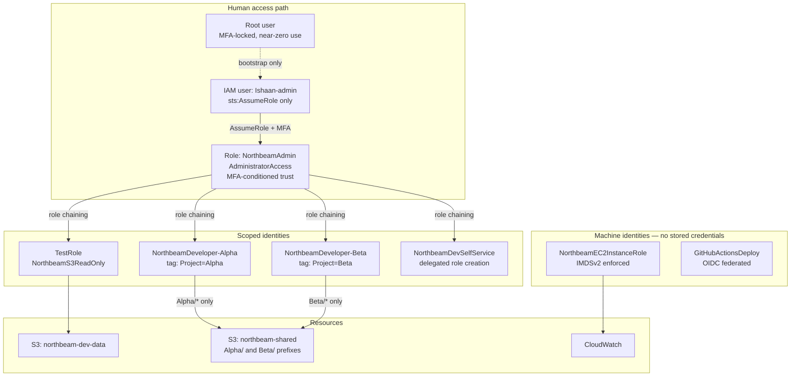
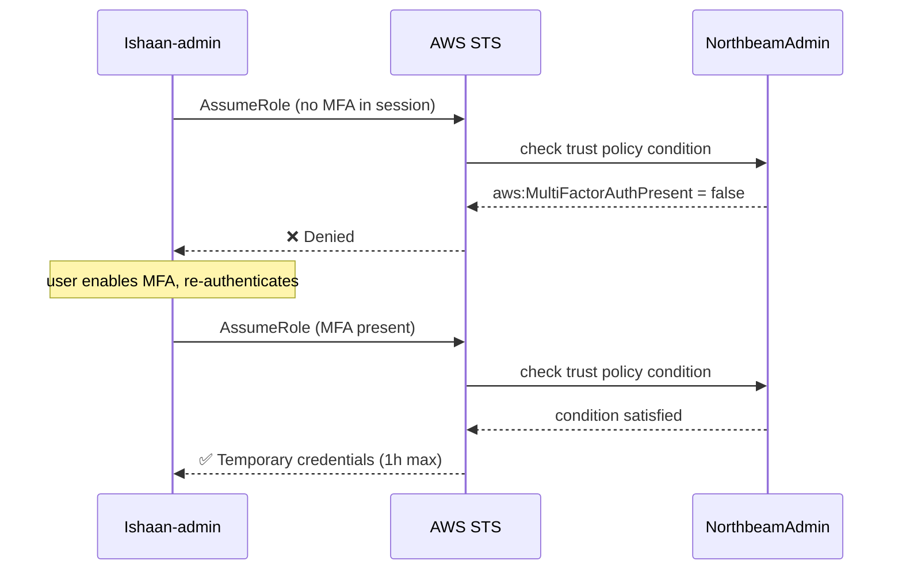
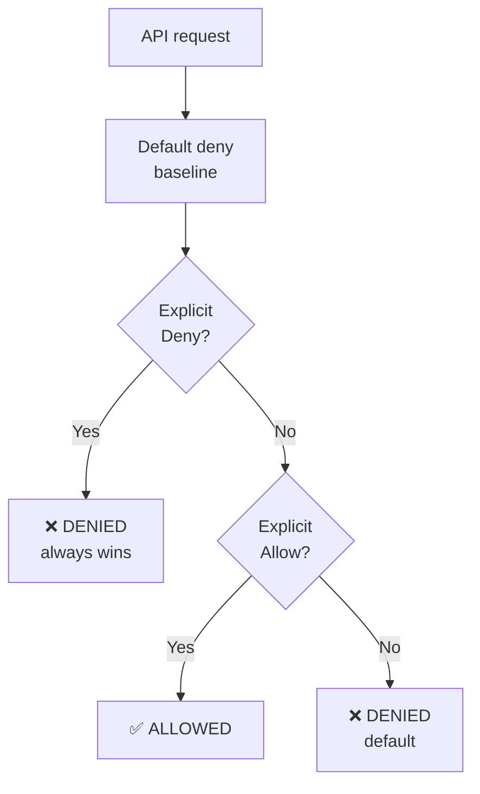
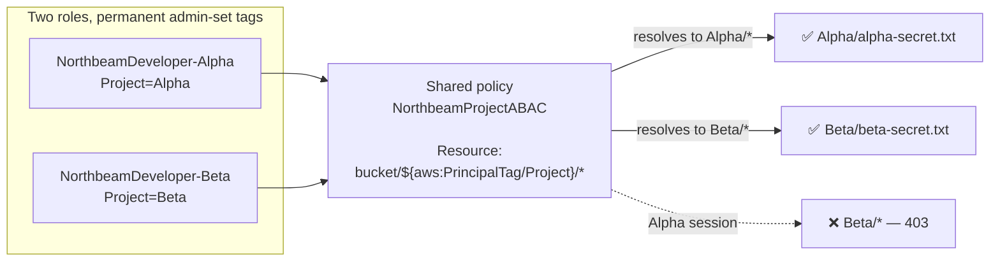
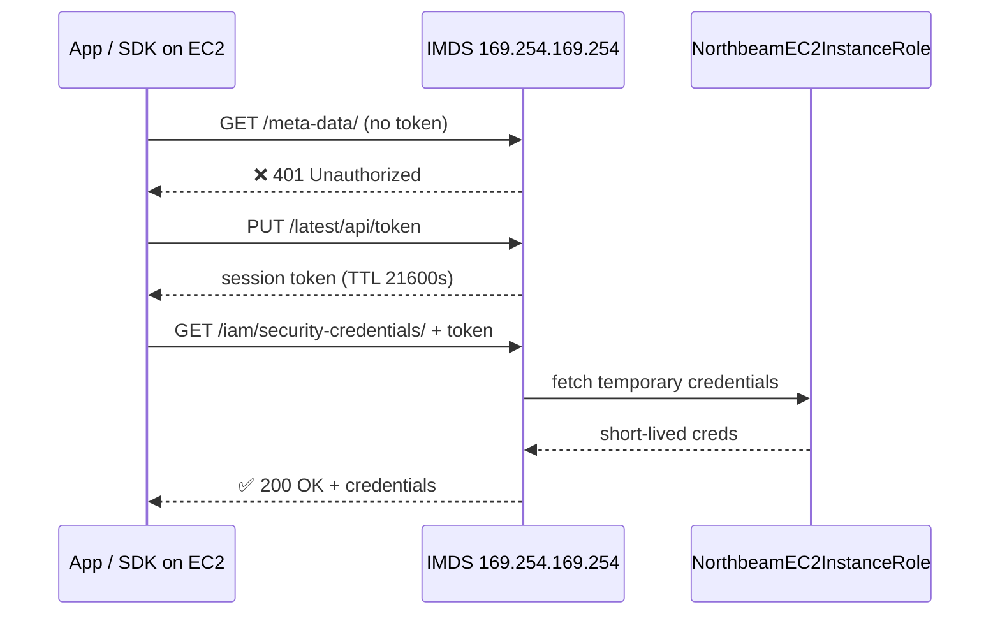
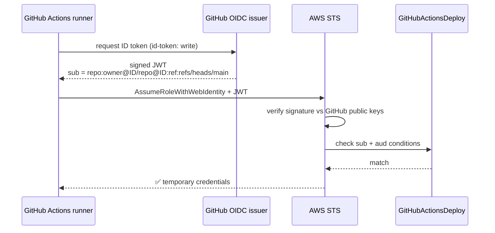
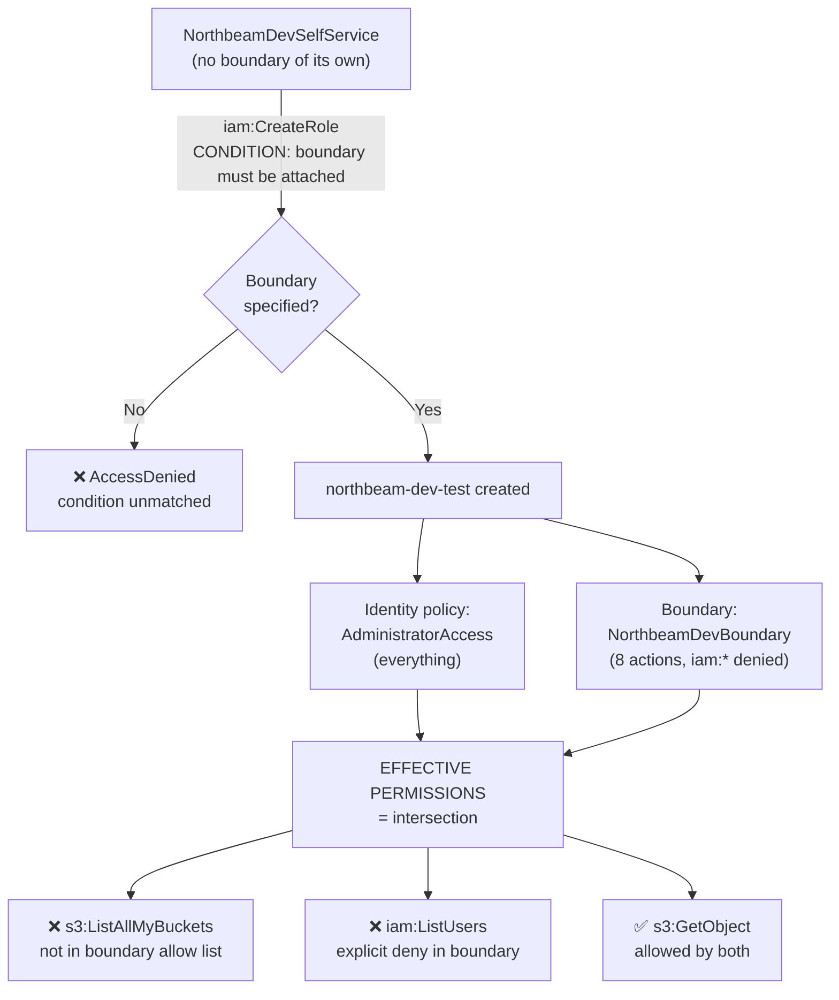
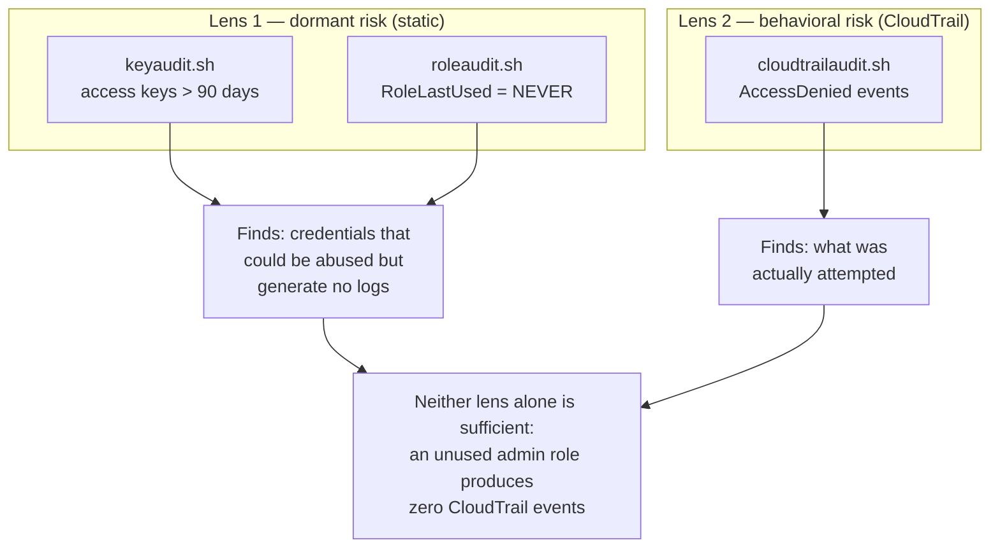

# Architecture — Northbeam Lite

Diagrams are written in Mermaid and rendered natively by GitHub.

## Overall architecture

## Milestone 1 — MFA-gated assumption

## Milestone 2 — policy evaluation order

## Milestone 3 — ABAC resolution

## Milestone 4a — IMDSv2 flow

## Milestone 4b — GitHub OIDC exchange

## Milestone 5 — permissions boundary intersection

## Milestone 6 — two audit lenses

